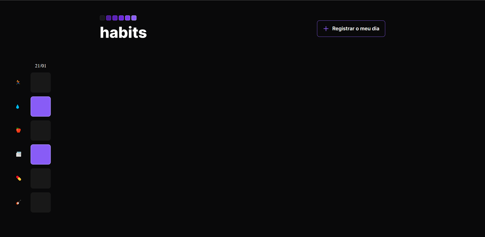

# Projeto NLW-Setup

---

## Tecnologias

  

---

## O que aprendi

- Estruturar o HTML
- Conectar o CSS
- Extrair figuras SVG do Figma
- Trabalhar a lógica do JavaScript

---

## Contato

<a href = "mailto:probertos717@gmail.com">
